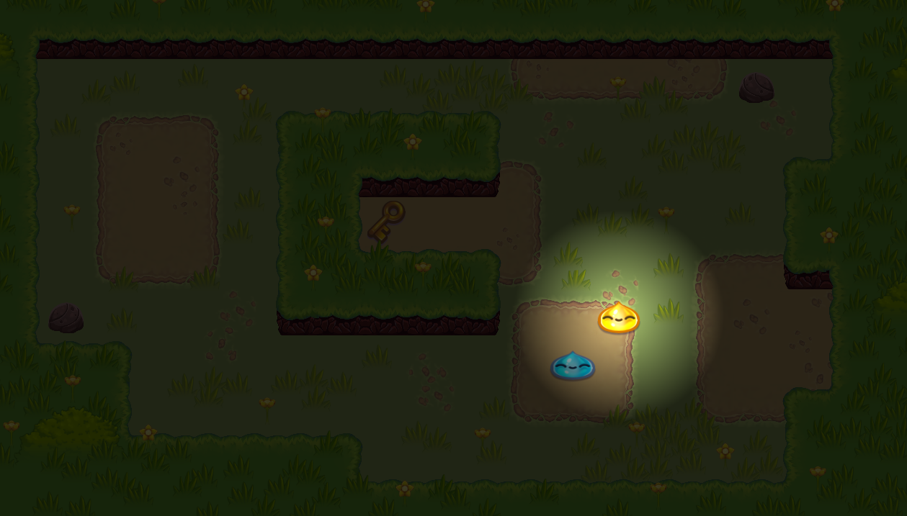

<!-- TABLE OF CONTENTS -->

  
Table of Contents

  <ol>
	<li>
	  <a href="#about-the-project">About The Project</a>
	  <ul>
		<li><a href="#built-with">Built With</a></li>
	  </ul>
	</li>
	<li>
	  <a href="#getting-started">Getting Started</a>
	  <ul>
		<li><a href="#prerequisites">Prerequisites</a></li>
		<li><a href="#installation">Installation</a></li>
	  </ul>
	</li>
	<li><a href="#usage">Usage</a></li>
	<li><a href="#contributing">Contributing</a></li>
	<li><a href="#license">License</a></li>
  </ol>

<!-- ABOUT THE PROJECT -->
## About The Project

[]

Building off a Godot official RPG Demo, I used a quadtree data structure to implement a simple search and reveal positional system. This takes the form of a yellow slime you control, that as you move him forward, utilizes this quadtree to search the immediate area to find enemy slimes and reveals them.

The goal of this was to do a from scratch implmentation of an effecient way to locate objects via organizing and storing them by their positions.

Why use a quadtree:
* A quadtree can take in spatial positioning data and offers good performance for insertion, removal and lookup. 
* In a game, spatial data is constantly changing, you need fast performing structures to handle the retreival and processes of this data.
* Tha alternative would be a brute force approach of checking all intersections. 

### Visual Walkthrough

(<a href="#readme-top">back to top</a>)

### Built With

* [Godot](https://godotengine.org/)
* C#

(<a href="#readme-top">back to top</a>)

<!-- GETTING STARTED -->
## Getting Started

This project was written with Godot Engine .NET v4.2.2 in compatibility mode.

### Prerequisites

[.NET SDK](https://dotnet.microsoft.com/en-us/download) 

### Installation

Import project via Godot
Build via Godot .NET builder

(<a href="#readme-top">back to top</a>)

<!-- USAGE EXAMPLES -->
## Usage

Use Godot editor play button.
Use WASD to move.

(<a href="#readme-top">back to top</a>)

<!-- LICENSE -->
## License

Distributed under the MIT License. See `LICENSE.txt` for more information.

(<a href="#readme-top">back to top</a>)

